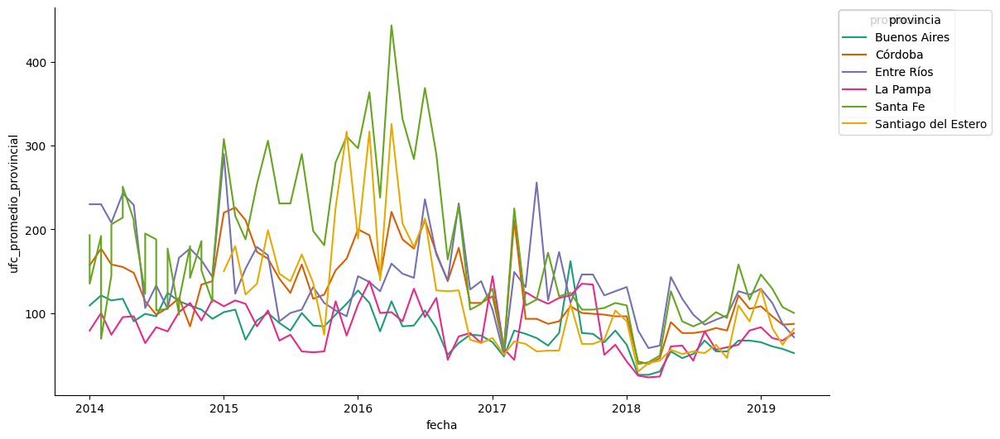
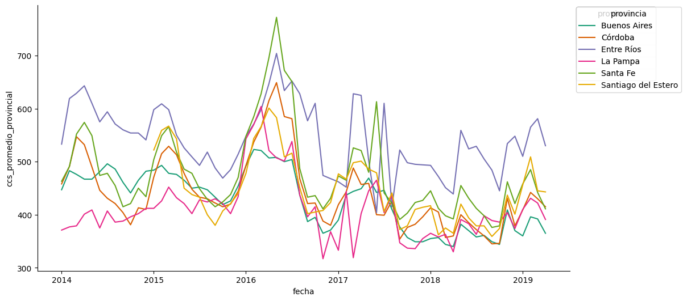

# Calidad de Higiene

<a target="_blank" href="https://cookiecutter-data-science.drivendata.org/">
    
</a>

## Presentación:

La leche es un producto importante para una sociedad, segun la organizacion OCLA, se consumen 118 litros por persona al año. Ademas la leche tiene productos derivados como la manteca, yogurt, queso, crema de leche, helado, dulce de leche y un monton de productos mas. Entonces saber en que niveles de calidad de higiene se encuentra este producto en Argentina seria un tema interesante de saber. Acompañame a conocer como fue evolucionando la calidad de higiene de la leche en Argentina desde el 2014 hasta el 2019.

## Objetivos:

Este proyecto tiene como objetivo el implear un modelo predictivo basado en 2 variables importantes que se usa para evaluar la calidad de higiene de la leche cruda. Los objetivos que me impuse para poder realizar este proyecto son:

-¿Existen patrones estacionales que afecten a la calidad higiénica de la leche cruda?

-¿Hay alguna diferencia notable entre las distintas provincias? 

-¿Cómo fue evolucionando la calidad de higiene? ¿Fue un aumento de calidad o disminuyo?

-¿Es posible predecir los niveles de UFC y CCS en la leche cruda para los próximos meses o años utilizando un modelo de Machine Learning?

-¿Qué tendencias futuras se pueden anticipar tanto a nivel nacional como provincial?

## Origenes de los datos:

Los datos fueron extraidos de la pagina "datos.gob.ar", alli fueron descargados cuatro archivos CSV, dos de ellos registran a nivel nacional y los otros dos a nivel provincial. Cada par de archivos registra una variable de medicion, uno registra las unidades formadoras de colonias (UFC) y la otra las cantidad de celulas somaticas (CCS). 
El conjunto a nivel provincial tiene 9 columnas: "indice tiempo" (string), "pais id" (int), "pais" (string), "producto id" (int), "producto" (string), "unidad de medida" (string), "cantidad" (int), "provincia id" (int), "provincia" (string), con un total de 766 instancias. Mientras que el conjunto a nivel nacional tiene 7 columnas, las mismas que el conjunto provincial pero sin las columnas "provincia id" ni "provincia", y cuenta con un total de 150 instancias.
Las columnas más relevantes para este proyecto son "indice tiempo", "cantidad" y "provincia". La columna "cantidad" fue renombrada por "ccs_promedio_provincial" y "ufc_promedio_provincial" respectivamente. la columna CCS esta midiendo por miles de celulas, mientras que UFC esta midiendo por miles de unidades.

Para tener una referencia de que tan alto pueden ser los niveles estudiados en los datasets, vamos a tomar de referencia los estandares mundiales que tambien fueron aplicados en un documento publicado por el gobierno en el 2018, este archivo se puede encontrar en la carpeta de "reference" llamado "anmat-capitulo_viii_lacteosactualiz_2018-11". Estos estandares mundiales indican que un nivel de ccs inferior 200.000 se considera que es de buena calidad. Entre 200.000 y 400.000 se lo considera aceptable y por encima de los 400.000 se lo toma como problemas potenciales. En el caso de ufc, una leche de buena calidad tiene menos de 50.000 ufc/ml, una de calidad aceptable oscila entre los 50.000 y los 100.000 ufc/ml y si tiene mas de 100.000 se considera como un problema potencial.
Argentina tiene desde el 2018 los limites maximos en 400.000 ccs/ml y 100.000 ufc/ml.

## work in progress


------------------------------------------------------------------------------------------------------------------------------------------------------------------------------------------------------------------------------------------------------------------------------------------------------------------------------------------------------------------------------------------------------------------------------------------------------------------------------------------------------------------------------------------------------------------------------------------------------------------------------------------------------------------------------------------------------------------------------------------------------------------------------------------------------------------------------------------------------------------------------------------------------------------------------------------------------------------------------------------------------------------------------------------------------------------------------------------------------------------------

## Descripcion y origenes:

Este proyecto tiene como objetivo desarrollar un modelo de predicción basado en cuatro archivos CSV para estimar la calidad de higiene de la leche cruda en Argentina. Los conjuntos de datos fueron obtenidos de la página "datos.gob.ar". Dos fuentes principales de datos son "Lácteos - Calidad higiénico sanitaria de la leche cruda a nivel provincial" y "Lácteos - Calidad higiénico sanitaria de la leche cruda a nivel nacional", adquiridos el 2/6/2024. La razón de tener dos conjuntos de datos por cada nivel es debido al registro de las células, donde hay un registro en cada CSV.

Los conjuntos de datos se componen de la siguiente manera:

El conjunto a nivel provincial tiene 9 columnas: "indice tiempo" (string), "pais id" (int), "pais" (string), "producto id" (int), "producto" (string), "unidad de medida" (string), "cantidad" (int), "provincia id" (int), "provincia" (string), con un total de 766 instancias.
El conjunto a nivel nacional tiene 7 columnas, las mismas que el conjunto provincial pero sin las columnas "provincia id" ni "provincia", y cuenta con un total de 150 instancias.

## Columnas relevantes:

Las columnas más relevantes para este proyecto son "indice tiempo", "cantidad" y "provincia".

La columna "cantidad" fue renombrada por "ccs_promedio_provincial" y "ufc_promedio_provincial" respectivamente. la columna CCS esta midiendo por miles de celulas, mientras que UFC esta midiendo por miles de unidades.

## Limites maximos para CCS y UFC

Para tener una referencia de que tan alto pueden ser los niveles estudiados en los datasets, vamos a tomar de referencia los estandares mundiales que tambien fueron aplicados en un documento publicado por el gobierno
en el 2018, este archivo se puede encontrar en la carpeta de "reference" llamado "anmat-capitulo_viii_lacteosactualiz_2018-11". Estos estandares mundiales indican que un nivel de ccs inferior 200.000 se considera que es de buena calidad. Entre 200.000 y 400.000 se lo considera aceptable y por encima de los 400.000 se lo toma como problemas potenciales.
En el caso de ufc, una leche de buena calidad tiene menos de 50.000 ufc/ml, una de calidad aceptable oscila entre los 50.000 y los 100.000 ufc/ml y si tiene mas de 100.000 se considera como un problema potencial.
Argentina tiene desde el 2018 los limites maximos en 400.000 ccs/ml y 100.000 ufc/ml.

## Interpretacion de como fue evolucionando la calidad de la leche cruda con el pasar del tiempo

Aca se puede observar una grafica de la variable UFC. A primera vista se puede observar que hay picos demasiado altos correspondientes de las provincias de Santa Fe, Santiago del Estero y Entre Rios. 
Alcanzando un maximo de 444 en el año 2016. La media de ufc antes de la primera mitad del 2017 fue del 129.60 ufc/ml. Luego de la primera mitad el promedio bajo al 83.90 ufc/ml.



En el caso de CCS se puede observar lo mismo que con el UFC, se puede observar una mejora pero esta vez mas leve, despues de la segunda mitad del año 2017 los valores mantuvieron una media de 420.37 .
Las provincias que tuvieron picos mas altos desde que se tiene registro fueron las provincias de Santa Fe, Entre Rios y Cordoba. 


A pesar de que todas las provincias suelen estar muy por encima del limite estipulado, las que suelen tener los niveles mas bajos son Buenos Aires y La Pampa. Mientras que Santa Fe, Entre Rios, Santiago
del Estero y Cordoba suelen ser las mas altas, principalmente las primeras 2 mencionadas. 

### Project Organization

```
├── LICENSE            <- Open-source license if one is chosen
├── Makefile           <- Makefile with convenience commands like `make data` or `make train`
├── README.md          <- The top-level README for developers using this project.
├── data
│   ├── external       <- Data from third party sources.
│   ├── interim        <- Intermediate data that has been transformed.
│   ├── processed      <- The final, canonical data sets for modeling.
│   └── raw            <- The original, immutable data dump.
│
├── docs               <- A default mkdocs project; see mkdocs.org for details
│
├── models             <- Trained and serialized models, model predictions, or model summaries
│
├── notebooks          <- Jupyter notebooks. Naming convention is a number (for ordering),
│                         the creator's initials, and a short `-` delimited description, e.g.
│                         `1.0-jqp-initial-data-exploration`.
│
├── pyproject.toml     <- Project configuration file with package metadata for {{ cookiecutter.module_name }}
│                         and configuration for tools like black
│
├── references         <- Data dictionaries, manuals, and all other explanatory materials.
│
├── reports            <- Generated analysis as HTML, PDF, LaTeX, etc.
│   └── figures        <- Generated graphics and figures to be used in reporting
│
├── requirements.txt   <- The requirements file for reproducing the analysis environment, e.g.
│                         generated with `pip freeze > requirements.txt`
│
├── setup.cfg          <- Configuration file for flake8
│
└── {{ cookiecutter.module_name }}                <- Source code for use in this project.
    │
    ├── __init__.py    <- Makes {{ cookiecutter.module_name }} a Python module
    │
    ├── data           <- Scripts to download or generate data
    │   └── make_dataset.py
    │
    ├── features       <- Scripts to turn raw data into features for modeling
    │   └── build_features.py
    │
    ├── models         <- Scripts to train models and then use trained models to make
    │   │                 predictions
    │   ├── predict_model.py
    │   └── train_model.py
    │
    └── visualization  <- Scripts to create exploratory and results oriented visualizations
        └── visualize.py
```

--------

